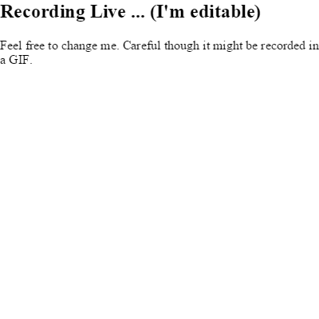

gifrecordeR
===========

> gifrecordeR

Easily record animated GIFs of your `R` web session straight client side
with this `htmlwidget wrapper` for
[gifw00t](https://github.com/yaronn/gifw00t). Use it for documentation,
illustration, or fun.

Thanks to all the code and amazing examples from [Yaron Naveh
@yaronn](https://twitter.com/YaronNaveh). See his other unbelievable
work, such as the \>6,000 star
[blessed-contrib](https://github.com/yaronn/blessed-contrib). He
deserves all the credit and praise for this. I simply added the
`htmlwidget` wrapper.

Installation
------------

    devtools::install_github("timelyportfolio/gifrecordeR")

Usage
-----

    library(gifrecordeR)
    library(htmltools)

    browsable(
      tagList(list(
        tags$div(
          id = "div_record",
          style = "width: 400px; height: 400px;",
          tags$h2(
            contentEditable = "true",
            "Recording Live ... (I'm editable)"
          ),
          tags$p(
            contentEditable = "true",
            "Feel free to change me.  Careful though it might be
            recorded in a GIF."
          )
        ),
        gifrecord("#div_record")
      ))
    )

License
-------

-   [gifw00t](https://github.com/yaronn/gifw00t) - **GPL V3** thanks
    [@YaronNaveh](http://twitter.com/YaronNaveh)

-   `gifrecordeR` - MIT + file LICENSE © [Kenton
    Russell](https://github.com/).
